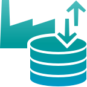
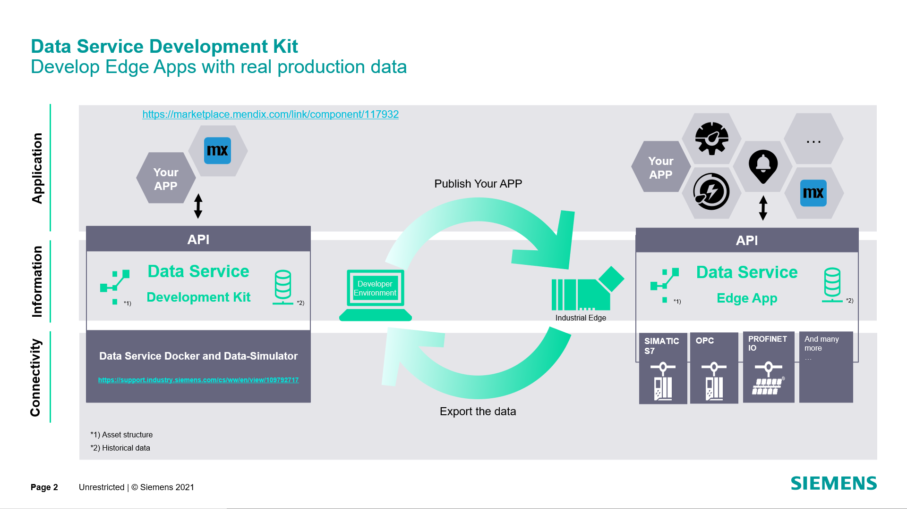

# IIH Essentials Development Kit

<br>
<div align="center">
    
    <br>
    <i>IIH Essentials is a central data storage for Industrial Edge, connecting you with many
        <br> data sources available on the platform.</i>
    <br>
</div>
<br><hr><br>
<div align="center">
    
</div>
<br><hr><br>

- [IIH Essentials Development Kit](#iih-essentials-development-kit)
  - [Documentation](#documentation)
  - [Getting Started](#getting-started)
    - [Prerequisites](#prerequisites)
    - [Setting up](#setting-up)
    - [Limitations](#limitations)
  - [Examples](#examples)
    - [Example Client](#example-client)
  - [What's new](#whats-new)
  - [Community](#community)
  - [Contact us](#contact-us)
  - [Contribution](#contribution)
  - [Licence and Legal Information](#licence-and-legal-information)

## Documentation

Using the IIH Essentials Development Kit​ you can develop apps based on the IIH Essentials and integrate them into Siemens Industrial Edge.

In this repository you can find the following components:
- <a href="docker-compose.yml">​Docker file: docker-compose.yml</a>
- <a href="./docs">Documentation</a>
  - <a href="./docs/iih-essentials">IIH Essentials documentation and ​API specification</a>
  - <a href="./docs/development-kit">Development Kit documentation</a>
- <a href="./examples">Examples</a>

By running the docker compose configuration, an API instance of the IIH Essentials will be started on your machine. This can be used to easily develop and test your application during development. The API specification is available [here: API specification](./docs/data-service/api-documentation/data-service-api-specification.html). This file needs to be opened locally in a browser.

An image is loaded from Docker Hub, containing these components:

- IIH Essentials -> provides the external interface (REST API) for non-Siemens applications)
- ​MQTT Broker -> used to transfer data from the simulator to the IIH Essentials
- Data simulator -> simulate simple data like sinus, inc/dec or custom data sequences

## Getting Started

### Prerequisites

- Install Docker
- Install NodeJS (only for running examples)
- Create Docker-Compose file

In order to run the IIH Essentials development kit you need  to define and execute a Docker-Compose file.
The docker-compose.example.yml is an example Docker-Compose file that can be used to download and run the required docker image(s) of the service(s) that runs in this application example. If you choose to use these, rename the file to docker-compose.yml before proceeding

### Setting up

Clone repository to your computer and switch into the repository:

``` cmd
git clone <repository_url>
cd ./<repository_name>
```

Run the docker compose start command:

``` cmd
docker-compose up
```

​All service images are downloaded from Docker Hub and launched as defined in the ```​docker-compose.yml​``` file.

Use the Simulation UI to create tags with simulated data that can be connected to IIH Essentials variables. To access the Simulation UI open this address in a browser:

``` browser
http://localhost:4519
```

Use the IIH Essentials UI to configure data connections and structure your data. You can connect simulated tags to variables. This will store the data and offer it through the API, making it available for 3rd party apps to use. To access the IIH Essentials UI open this address in a browser:

``` browser
http://localhost:4203​
```

### Limitations

The IIH Essentials in the Development Kit is a limited version of the IIH Essentials:

- Data retention: ​By default, the data is kept for one week. This cannot be changed.
- Adapters/Connectors: Existing adapters/connectors cannot be modified or deleted. No new adapters/connectors can be added.

## Examples

### Example Client

​This application example is intended to show how to get access to the IIH Essentials API as an external app.
It shows how to create a user, request a token and get assets, tags and time series data from the the IIH Essentials. ​It is available [here: ExampleClient](./examples/ExampleClient). More details can be found inside the ExampleClient folder.

## What's new

<details>
  <summary>
    <h2 style="display: inline">v1.7.0 - 2023-06-22</h2>
  </summary>
  <h3>Added</h3>
  <ul>
    <li>Feature 1478167: Encrypted backups</li>
    <li>Feature 1733570: MindSphere connectivity</li>
    <li>Feature 1977721: Bulk API</li>
  </ul>
  <h3>Fixed</h3>
  <ul>
    <li>Bug 1018113: On Asset & Connectivity view the splitter handle is displayed above open dialogs if mouse cursor hovers over the splitter handle</li>
    <li>Bug 1211347: Dataservice App V1.2.0 HmiRuntime conenctor does not work with HMI Tags typ bool</li>
    <li>Bug 1422222: Child assets are not getting displayed when user has more parent child related assets</li>
    <li>Bug 1422336: Horizontal scroll bar is not expanding when user has more parent child assets</li>
    <li>Bug 1833547: SWT: IIH: Storage- Graph is not getting plotted in preview chart with respective of Seconds</li>
    <li>Bug 1846806: IIH : Data Service : mindsphere credentials are visible as plaintext in mdsp-config.json file in edge-box</li>
    <li>Bug 1851732: SWT: IIH:Internet is not working in the edge box,eventhough proxy is set</li>
    <li>Bug 1921811: Unable to change the name of defined type aspect</li>
    <li>Bug 1925994: Data Service - Wrong display of bool values in data preview</li>
    <li>Bug 1937427: IIH: MindSphere Sync data upload stops after adding variable to aspect</li>
    <li>Bug 2065657: Connection status of variables remains in connected state even if connector is deactivated</li>
    <li>Bug 2088890: TC : Store data : System information parameter values are not displaying properly except CPU load</li>
    <li>Bug 2175400: Data retention of child asset remains unchanged when moved from one parent asset to other</li>
    <li>Bug 2186597: No validation while restoring time series data</li>
    <li>Bug 2189867: IIH MindSphere Sync: Confusing error message when device has no connection to Mindsphere</li>
    <li>Bug 2189944: IIH MindSphere Sync: Confusing error message when MQTT connection is blocked</li>
    <li>Bug 2217030: Energy Manager: Diagram widget doesn't show any data if calculation period set to >24 days</li>
    <li>Bug 2236092: IIH Integration: "Retention policy" instead of "Store Data" is shown in bread crumb on the Store Data page</li>
    <li>Bug 2248213: An error is displayed when user adds aggregations to a variable</li>
    <li>Bug 2257814: Clicking on cancel button results in switching Retention policy toggle on</li>
    <li>Bug 2260350: TC : Data is not syncing for newly added variable in existing asset-aspect tree</li>
    <li>Bug 2263220: Tenant technical user not able to login to CloudSync</li>
    <li>Bug 2306875: Tree closes on each page switch</li>
    <li>Bug 2306886: No redirection when deleting a parent asset of the selected asset</li>
    <li>Bug 2308562: Moving the parent asset into its child makes DS unusable</li>
    <li>Bug 2369032: IIH MindSphere Sync: Error message misleading when no connection to MindSphere</li>
    <li>Bug 2376960: Data loss in Mindsphere while in Data Service data is complete</li>
    <li>Bug 2384198: TC : Data loss is seen for newly added variable in new asset-aspect tree in the MDSP.</li>
    <li>Bug 2393885: TC : Dataservice container getting stopped frequently when variable load of 1000 added to the Asset tree.</li>
    <li>Bug 2395477: IIH Cloud Sync doesn't accept app credential format</li>
    <li>Bug 2402728: An unknown error is getting displayed for asset mindsphere sync</li>
    <li>Bug 2404395: Data destination is not getting saved for variable aggregation for the first time</li>
    <li>Bug 2404430: DataRetention call with invalid combination in aspect edit</li>
    <li>Bug 2404463: Edit asset name to old name is blocked</li>
  </ul>
</details>

<details>
  <summary>
    <h2 style="display: inline">v1.6.0 - 2023-03-31</h2>
  </summary>
  <h3>Added</h3>
  <ul>
    <li>Epic 599113: Datatype blob</li>
    <li>Epic 1445051: Debugging view</li>
    <li>Epic 1445127: Add available connectors</li>
    <li>Epic 1445141: Aggregations UI improvements</li>
    <li>Epic 1538556: 1.4.0 migration cleanup</li>
    <li>Epic 1682750: Extend errors and translation in UI</li>
    <li>Epic 1684984: Variable and counter configuration in Data Service</li>
    <li>Epic 1685823: CSV export of variable data</li>
    <li>Epic 1772094: Add databus settings</li>
    <li>Epic 1864384: Encrypted/secured config store</li>
    <li>Epic 1928463: Optimize panel performance</li>
  </ul>
  <h3>Fixed</h3>
  <ul>
    <li>Bug 345213: Swt Dataservice:-BACKEND UI is geeting Overlapped when user try to perform such operation(Add,Delete,Edit,Move)</li>
    <li>Bug 1054490: Pagination should be displayed irrespective of number of variables added to asset</li>
    <li>Bug 1063799: Data Service - Preview chart data points are not visible</li>
    <li>Bug 1111798: PostgreSQL 9.6.x, 10.x, 11.x, 12.x, 13.x, 14.x - Multiple Vulnerabilities - 9.6.24, 10.19, 11.14, 12.9, 13.5, 14.1</li>
    <li>Bug 1111808: PostgreSQL 9.6.x, 10.x, 11.x, 12.x, 13.x, 14.x - Multiple Vulnerabilities - 9.6.24, 10.19, 11.14, 12.9, 13.5, 14.1</li>
    <li>Bug 1208364: SWT: IIH: Storage:-  Updating the asset in the storage page takes more time than expected</li>
    <li>Bug 1245345: New variables from S7C not appearing in Data Service</li>
    <li>Bug 1333382: SWT: IIH:Storage-  Editing the asset in the storage part takes more time to reflect</li>
    <li>Bug 1342769: Variables with same name but from different simulation group cant be seen while adding to asset</li>
    <li>Bug 1349173: Adapter dropdown in Add variable is open by default</li>
    <li>Bug 1472146: RAM load in system information page shows infinity</li>
    <li>Bug 1472160: Chart values get overlapped with x axis unit in all the graphs</li>
    <li>Bug 1594425: IIH: store data Assets gone after reboot, Performance Insight Dashboards lost</li>
    <li>Bug 1645331: TC: Data Service - Not all tags are added as variables. Out of 2000 tags only around 1300 /850 are added.</li>
    <li>Bug 1649580: Both Select a connector and Edit variable without a connector options are enabled</li>
    <li>Bug 1726699: Debian GNU/Linux 11 - curl Multiple Vulnerabilities - DSA-5197-1</li>
    <li>Bug 1736176: Update aspect with changed aspect type does not return an exception</li>
    <li>Bug 1761878: UI crash if asset data retention is changed in dev kit</li>
    <li>Bug 1767604: Can't import Data Service V1.3 backup into Data Service V1.4 if step time analysis Aspects are configured</li>
    <li>Bug 1770341: Step time analysis in Performance Insight is not detecting product type</li>
    <li>Bug 1826187: Step Time Analysis Get Error HTTPS </li>
    <li>Bug 1835370: SWT  IIH : Able to see Standalone ( Data service) data after IIH mode  integration</li>
    <li>Bug 1837132: SWT IIH : Mismatch in label names</li>
    <li>Bug 1841563: SWT : Data Service : In Stand alone mode Restore backup of the configuration field is not working properly.</li>
    <li>Bug 1841582: SWT : Data Service : In Standalone mode no message after Restore of of time series data.</li>
    <li>Bug 1841600: IIH : Store Data : While integrating Data Service, pop-up shows wrong message - all data of the data service will be lost.</li>
    <li>Bug 1843308: Dataservice: variable not displayed after adding other variable with same name.</li>
    <li>Bug 1856806: Creation of variable without connector is having adapter connection</li>
    <li>Bug 1858438: Data Service does not work when disk full</li>
    <li>Bug 1885808: SWT IIH : Getting Not enough memory to open this page  error in all IED , Data service(Stand alone)  and IIH configurator  when 8K tags are configured in S7 Plus connector</li>
    <li>Bug 1885830: Dataservice: High CPU load of IED227E</li>
    <li>Bug 1889868: Long variable names not readable</li>
    <li>Bug 1896045: Data Service Language continuity</li>
    <li>Bug 1904115: Data Service crash when HMIRuntime connector is activated but not present</li>
    <li>Bug 1916473: Dataservice in IIH mode - Dataservice stops receiving new data after power off restart of device</li>
    <li>Bug 1918640: Backup restore data wont get displayed until refresh</li>
    <li>Bug 1919872: Corrupted files if disk is full</li>
    <li>Bug 1924106: Aspect type field should be mandatory while creating defined type aspect</li>
    <li>Bug 1925140: cURL 7.7.x ≤ 7.85.0 - Multiple Vulnerabilities - 7.86.0</li>
    <li>Bug 1925421: libxml2 2.9.10 ≤ 2.9.14 - Remote Denial of Service Vulnerability - 2.10.0</li>
    <li>Bug 1925425: cURL 7.7.x ≤ 7.85.0 - Multiple Vulnerabilities - 7.86.0</li>
    <li>Bug 1927843: Node.js Package: core-js ≤ 3.23.2 - End of Life Notification (EOL)</li>
    <li>Bug 1932696: Initialization fails if disk is full</li>
    <li>Bug 1935592: DataService: Socket hang up when getting data for a month</li>
    <li>Bug 1936078: CS connectors can not be added because name is missing</li>
    <li>Bug 1936079: Already added connectors still visible in add view</li>
    <li>Bug 1939004: IIH: Restoring backup before integrating Data Service leads to duplicate Assets</li>
    <li>Bug 1939285: Add variable to aspect is inefficient</li>
    <li>Bug 1939538: IIH: variables not connected to S7C tags from Databus after mapping</li>
    <li>Bug 1939633: Full variable name not visible</li>
    <li>Bug 1940733: Select all in Add multiple variables displays error when any one of the variable is already present</li>
    <li>Bug 1940768: Aggregations are getting erased in Edit variable dialog</li>
    <li>Bug 1941283: Store property ignored when an adapter restarted or dataservice app restarted</li>
    <li>Bug 1941334: Data API returns one value in case from and to parameters are before the first data point</li>
    <li>Bug 1943864: Data retention doesn't work for aggregation variables</li>
    <li>Bug 1947070: DataService: Filter still shown after variable deletion, but page is refreshed </li>
    <li>Bug 1949087: Backup restore can not handle string values which have new line characters</li>
    <li>Bug 1968889: Data retention is not inherited from variable for aggregations</li>
    <li>Bug 1971917: Debian GNU/Linux 10 - krb5 Remote Denial of Service Vulnerability - DLA-3213-1</li>
    <li>Bug 1975286: Factor field in Add variable dialog allows negative values to save</li>
    <li>Bug 1993784: Data retention error for large retention values</li>
    <li>Bug 1993788: Variable configuration fields are made mandatory while adding a variable</li>
    <li>Bug 2041574: TRA tracker: DataService v1.6</li>
    <li>Bug 2041989: Error message is not correct while moving an asset with same name into another asset</li>
    <li>Bug 2041998: Wrong error message for variables with long name</li>
    <li>Bug 2042049: Asset moving functionality is not getting stopped even after error</li>
    <li>Bug 2048520: Performance Insight Warning HTTP request</li>
    <li>Bug 2049650: IIH: variable store option checked by default after mapping</li>
    <li>Bug 2051210: Dev kit: Data retention gets erased when user tries changing it</li>
    <li>Bug 2051566: Adapter errors are still displayed after fixing the adapter config</li>
    <li>Bug 2056086: Assets can be created with case sensitive names</li>
    <li>Bug 2057278: IIH: root asset not reselectable</li>
    <li>Bug 2057294: IIH: Layout resizing on navigate</li>
    <li>Bug 2058387: Step time analysis: connecting product variable in Data Service leads to various issues</li>
    <li>Bug 2059985: Unable to Edit asset after adding aggregated variables</li>
    <li>Bug 2065639: Full topic name is not displayed</li>
    <li>Bug 2068303: Topic value is overlapped on preview data icon</li>
    <li>Bug 2068319: Time range is not selectable in data export dialog</li>
    <li>Bug 2072552: Creating aggregation directly with data retention does not work</li>
    <li>Bug 2073084: Export variable data: Timerange is ignored when only from field is provided</li>
    <li>Bug 2079215: Unable to edit an asset which has child assets</li>
    <li>Bug 2082473: Password is visible in Databus settings</li>
    <li>Bug 2089240: Unable to add child asset from asset edit screen</li>
    <li>Bug 2089285: Databus settings missing in backup</li>
    <li>Bug 2090241: Variables created in IIH mode via Data Service API are not connecting</li>
    <li>Bug 2103157: Energy Manager - Wrong results with aggregation 'Counter'</li>
    <li>Bug 2167303: TC: IIH -Store Data tab does not open</li>
    <li>Bug 2175185: Unable to rename asset to old name</li>
    <li>Bug 2175454: Unable to see edit asset icon for assets with long names</li>
    <li>Bug 2180370: PdmCoreChanges check gets called multiple time parallel</li>
    <li>Bug 2187230: An error is getting displayed when user adds aggregation without data retention</li>
    <li>Bug 2187249: IIH Configurator variable configuration advanced tab is empty</li>
    <li>Bug 2216089: Data Service crashes with 20 000 variables on one asset</li>
  </ul>
</details>

<details>
  <summary>
    <h2 style="display: inline">v1.5.0 - 2022-11-08</h2>
  </summary>
  <h3>Added</h3>
  <ul>
    <li>Epic 841389: automatic migration to IIH mode</li>
    <li>Epic 1291958: OpenPipe browsing</li>
    <li>Epic 1341337: configuration fullscreen dialogs</li>
    <li>Epic 1444942: Enable/disable storing of variable</li>
    <li>Epic 1684997: Model mutation via API in IIH mode</li>
  </ul>
  <h3>Fixed</h3>
  <ul>
    <li>Bug 1081843: Data Service Backup configuration exposes credentials</li>
    <li>Bug 1399404: cURL, libcurl 7.16.1 ≤ 7.83.0 - Multiple Vulnerabilities - 7.83.1</li>
    <li>Bug 1612836: cURL, libcurl 7.16.4 ≤ 7.83.1 - Multiple Vulnerabilities - 7.84.0</li>
    <li>Bug 1626932: Node.js Package: moment < 2.29.4 - Remote Regular Expression Denial of Service Vulnerability - GHSA-wc69-rhjr-hc9g</li>
    <li>Bug 1652672: No confirmation message after restoring data backup</li>
    <li>Bug 1770507: Data Service: can't delete Asset which contains Aspects derived from AspectType</li>
    <li>Bug 1844550: EnergyManager: EnergyAnalysis with SubAsset leads to error</li>
    <li>Bug 1846613: Route AssetService/Assets/<id>/Decendants is missing</li>
    <li>Bug 1847314: IIH: Configuring additional data source leads to issues</li>
    <li>Bug 1858366: Create: Sporadical error when restoring configuration</li>
    <li>Bug 1859833: Clicking on Reset variable of Aggregated variable results in error</li>
    <li>Bug 1859856: Unable to remove aggregated variables from Aspect</li>
    <li>Bug 1861022: Passwords stored in DB are downloadable in plain text</li>
    <li>Bug 1868419: Unchecking archive checkbox of aggregated variable displays error</li>
  </ul>
</details>

<details>
  <summary>
    <h2 style="display: inline">v1.4.0 - 2022-08-15</h2>
  </summary>
  <h3>Added</h3>
  <ul>
    <li>1152241 Epic Data Service C++: Major performance improvements</li>
    <li>599109 Epic System info dashboard: Monitor the system with using the system info dashboard</li>
    <li>Pre-aggregate variables to reduce calculation response times</li>
    <ul>
      <li>955990 Epic Pre-calculated aggregation</li>
      <li>1032684 Epic Improve calculation performance using pre-aggregated data</li>
    </ul>
    <li>IIH integration: Run Data Service in IIH Mode</li>
    <ul>
      <li>1392382 Epic Running modes: Standalone and IIH</li>
      <li>1121415 Epic IIH frontend adaptions</li>
      <li>Connectivity Suite compatibility</li>
    </ul>
    <li>1024587 Epic Optimized UI for mobile</li>
    <li>1024592 Epic Optimized UI keyboard handling</li>
    <li>1028323 Epic New Simulation UI</li>
    <li>1389681 Epic Add new default adapters: New default adapters: SLMP, OPC UA, S7+</li>
    <li>1392451 Epic Migration of DS standalone 1.3 to 1.4</li>
  </ul>
  <h3>Fixed</h3>
  <ul>
    <li>1467230 Bug Edit variable dialog displays connection status of a variable without adapter</li>
    <li>1212027 Bug Dataservice App V1.2.0 HmiRuntime conenctor does not work with HMI Tags typ bool</li>
    <li>1063409 Bug Error when same timestamp is sent multiple times</li>
    <li>1678693 Bug Different response than in node version when data is not found</li>
    <li>1371927 Bug DS C++: Add variable dialog not displaying Datatype and Unit fields</li>
    <li>1397442 Bug Select all checkbox in Add multiple variable selects all the variables under a connector</li>
    <li>1383697 Bug Delete confirmation message for variable containing aggregated variables should be changed</li>
    <li>1678676 Bug Error when creating variable with same name in different aspects (UI + backend)</li>
    <li>1678663 Bug Error when creating variable with space at end of name (ui + backend)</li>
    <li>1397449 Bug An error occurred is getting displayed when user clicks on edit variable icon</li>
    <li>1373521 Bug Variable connected state does not go back to normal after connection is reestablished</li>
    <li>1492599 Bug Warning symbol is clickable in variable table</li>
    <li>1696695 Bug Aspect assets filter returns all aspects</li>
    <li>1661199 Bug Variable list is taking long to load</li>
    <li>1341356 Bug Data retention 1 second crashes database</li>
    <li>1641327 Bug Deleting child asset is causing an error</li>
    <li>1378117 Bug Backup json is not getting downloaded when include time series data toggle is on</li>
    <li>1656922 Bug Different aggregation is created than the selected</li>
    <li>1383680 Bug Deleting variable which has an aggregated variable results in stuck screen</li>
    <li>1656923 Bug Add variable button is getting disabled upon adding aggregation</li>
    <li>1664436 Bug Moving child assets with same name into an asset is not displaying any error </li>
    <li>1428317 Bug Unable to browse tags from System info adapter even after its connected</li>
    <li>1661155 Bug Unknown error gets displayed when adding variables to aspect</li>
    <li>1475717 Bug Error while try to add 2nd variable aggregation</li>
    <li>1634706 Bug Changing aggregation settings fails and deletes existing aggregation</li>
    <li>1322117 Bug Data Service failed to restore configuration because duplicate variables can be created</li>
    <li>1397433 Bug No Uniqueness in creation of child asset names</li>
    <li>1505139 Bug Dataservice app icon is not displaying in tab name</li>
    <li>1640664 Bug Child assets can not be expanded, when current asset is selected</li>
    <li>1191639 Bug REST API POST DataService/Data SQL Injection</li>
    <li>1529300 Bug TRA tracker: DataService v1.4</li>
    <li>1489368 Bug Heap size stats are not displaying in system info adapter</li>
    <li>1138791 Bug SWT: IIH:Organize data-No functionality give to the No limit  button in storage window</li>
    <li>1138790 Bug SWT: IIH:Organize data-No functionality given to the create Add aspect(+)  button in aspect window</li>
    <li>1138789 Bug SWT: IIH:Organize data- No functionality given to the create first aspect  button in aspect window</li>
    <li>1208366 Bug SWT: IIH:Storage:- Description need to improved ,when adding the asset in the storage page</li>
    <li>1176389 Bug SWT: IIH:Provide information - UI for the filter field is getting disturbed on clicking on the text.</li>
    <li>1421916 Bug Incorrect description for data retention in Edit variable and data retention dialogs</li>
    <li>1374452 Bug Mobile UI: Text is displayed outside the container in settings tab</li>
    <li>1379866 Bug Incorrect connection status is displayed for Aggregated variables</li>
    <li>1359984 Bug Drop textfile button is not clickable while creating value type simulation</li>
    <li>1063790 Bug Data Service - Preview chart auto refresh resets zoom</li>
    <li>1405186 Bug Reordering of assets is taking more time</li>
    <li>1342763 Bug Reset simulation data option is missing in Simulation group</li>
    <li>1393139 Bug Delete button is present when no retention is set for parent asset</li>
    <li>1341062 Bug Newly created variable is not displayed under simulation group</li>
    <li>1286990 Bug Mobile UI: Improper display of Adapter view</li>
    <li>1340688 Bug No Character limit for Simulation group name</li>
    <li>1340701 Bug No character limit for variable name under a simulation group</li>
    <li>1192029 Bug Data Service: After editing a variable on page 2 of the "connectivity" tab, page number is bugged</li>
    <li>1349180 Bug Unable to delete the aggregation variables </li>
    <li>1349648 Bug Mobile UI: Adapters are not displayed in adapters view</li>
    <li>1341351 Bug Delete button is displayed also if retention is not set</li>
    <li>1292945 Bug Mobile UI: Tag and Variable name displayed outside the container in edit variable dialog</li>
    <li>1018288 Bug Pagination issue - after deleting a variable in 2nd page the screen displays 1st page but shows page number as 2</li>
    <li>1018293 Bug Unable to delete Aspect from Connectivity screen</li>
    <li>1287070 Bug Wrong connection status is displayed in Edit variable dialog</li>
    <li>1294438 Bug Variable toggle button in Pre-calculated aggregation is not working as expected</li>
    <li>1294462 Bug Headers are missing in Pre-calculated aggregation section</li>
    <li>1303506 Bug Mobile UI: Sidebar is not closing after the selection</li>
    <li>1294483 Bug Adapters image is not loading</li>
    <li>1293357 Bug Delete confirmation message for variable deletion doesn't contain variable name</li>
    <li>1286870 Bug Data retention is blocking the UI if too many variables</li>
    <li>1275328 Bug Data retention field is revised to on for all variables </li>
    <li>1018123 Bug Pagination goes off after increasing the number</li>
    <li>1286910 Bug OpenPipe variables cannot be created in the UI</li>
    <li>1606837 Bug SWT: IIH: Buffered values are not updated to the mindsphere but stored in the data service</li>
    <li>1723683 Bug Adapter error is not updated on edit</li>
    <li>1233449 Bug SWT: IIH: Storage:-  Created asset model in provide information is not reflecting in the storage page</li>
  </ul>
</details>

<details>
  <summary>
    <h2 style="display: inline">v1.3.3 - 2022-02-25</h2>
  </summary>
  <h3>Fixed</h3>
  <ul>
    <li>1197005 Bug Booleans are sent in an unexpected format for some apps</li>
  </ul>
</details>

<details>
  <summary>
    <h2 style="display: inline">v1.3.0 - 2021-10-11</h2>
  </summary>
  <h3>Added</h3>
  <ul>
    <li>Predefined aspect types</li>
    <li>Create aspects from aspect types</li>
    <li>Backup/Recovery</li>
    <li>Preview chart</li>
    <ul>
      <li>Auto-refresh</li>
      <li>Select aggregation</li>
      <li>Select time range</li>
    </ul>
    <li>Better state/debug information</li>
      <ul>
        <li>Show variable errors</li>
        <li>Show adapter errors</li>
        <li>Show connection state of variable</li>
      </ul>
    <li>Create simple variables (variables without connector)</li>
    <li>Data retention per variable</li>
  </ul>
  <h3>Fixed</h3>
  <ul>
    <li>Delete dialog layout fixes</li>
    <li>Documentation of Data Service System Info Adapter</li>
    <li>Data gap after Zooming</li>
    <li>Missing variable information in "Add multiple variables" dialog</li>
    <li>344913 Bug SWT Data Service: In Delete asset window text overlapped with warning Icon</li>
    <li>345182 Bug Delete Icon wrong positioning</li>
    <li>345203 Bug Dataservice in UCPF:-unctionality for Add multiple variable is not properly defined</li>
    <li>345210 Bug SWT Data service:In custom adapter page required field mark is missing</li>
    <li>345217 Bug Swt Dataservice:-Support document is not updated with New UI Feature</li>
    <li>406023 Bug Decoupling of adapters and variables</li>
    <li>486194 Bug Documentation Data Service System Info Adapter for Metrics</li>
    <li>553071 Bug Data Service V1.2 cannot connect to Modbus Connector</li>
    <li>950629 Bug Data gap after Zooming</li>
    <li>955465 Bug Average bug</li>
    <li>955488 Bug Wrong calculated timers</li>
    <li>955496 Bug Coca Cola customer issue</li>
    <li>998383 Bug TRA tracking: EDGE Apps: DataService V1.3</li>
    <li>1024028 Bug Time series data is not getting imported</li>
    <li>1031160 Bug Time series backup is empty for large files</li>
  </ul>
</details>

<details>
  <summary>
    <h2 style="display: inline">v1.2.0 - 2021-05-21</h2>
  </summary>
  <h3>Added</h3>
  <ul>
    <li>New Aggregates: standard deviation, variance, count (number of datapoints), first</li>
    <li>custom adapters</li>
    <li>multi variable picker</li>
    <li>string support</li>
  </ul>
  <h3>Changed</h3>
  <ul>
    <li>Optimized calculation algorithm</li>
    <li>Values with bad quality code are not considered in calculation</li>
  </ul>
</details>

<details>
  <summary>
    <h2 style="display: inline">v1.1.0 - 2021-04-19</h2>
  </summary>
  Initial release of Data Service Development Kit.
</details>

<br>

## Community

You can ask questions in the [Industrial Edge support forum](https://support.industry.siemens.com/tf/ww/de/threads/337/).

## Contact us

[SIOS IIH Essentials for Industrial Edge](https://support.industry.siemens.com/cs/document/109784426)

[SIOS IIH Essentials Development Kit for Industrial Edge](https://support.industry.siemens.com/cs/document/109792717)

For support requests contact your regional contact person.
They take care of your concerns and give you feedback.

## Contribution

Thank you for your interest in contributing. Anybody is free to report bugs, unclear documentation, and other problems regarding this repository in the Issues section.
Additionally everybody is free to propose any changes to this repository using Pull Requests.

If you are interested in contributing via Pull Request, please check the [Contribution License Agreement](Siemens_CLA_1.1.pdf) and forward a signed copy to [industrialedge.industry@siemens.com](mailto:industrialedge.industry@siemens.com?subject=CLA%20Agreement%20Industrial-Edge).

## Licence and Legal Information

Please read the [Legal information](LICENSE.md).
