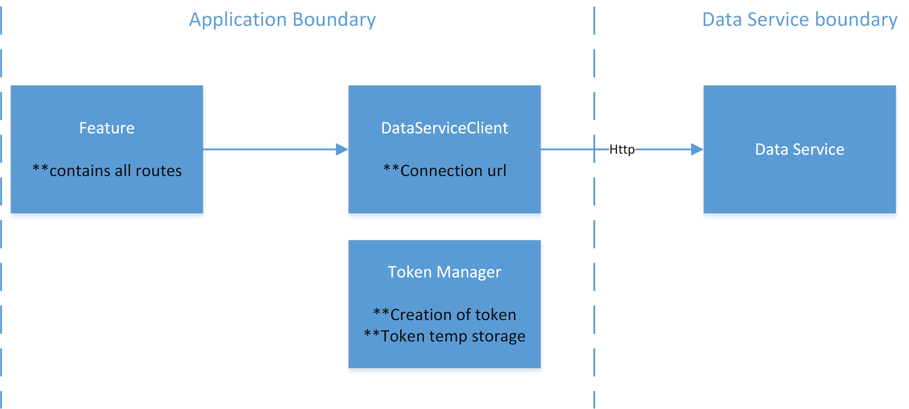

# Example Application:
## Scope of the Example
The application is intended for clients to get access to the Data Service as an external app. 
This example includes creating users, requesting a access token and retrieve assets, variables and timeseries data from the Data Service.

## Build and Execute:
Install the node_modules needed for building the project. Execute this command at the ExampleClient folder where the package.json is located:
```
npm install
```
Afterwards the project can be build:
```
npm run build
```
Finally, start the project locally:
```
npm run start
```
or via Docker:
```
docker-compose up
```

The application will start at port 5200:
```
http://localhost:5200
```

### Pre-requisite

The "Data Service" should be running already. Otherwise, an incorrect connection is provided when accessing the routes below.

## Logical View
The logical representation is divided into the following parts:



### Feature
The routes are hosted here and most of the integration for token and communicating with client is done at this class.
### TokenManager
With each call, the token is retrieved from the data service. However, it is advisable to store temporarily until the time it expires (30 minutes). The request to re-save from the token should ideally occur after each expiration.
### DataServiceClient
This class helps with the configuration of data service URL and setting up the connection. The authorization headers for the http request are also managed here.

## Create user and Token Management
An application can request a user for accessing the data service. This user provides a token that can be used to make calls to the Data Service. A token expires after 30 minutes, while a user does not expire. For user creation and token management please use the feature ```/User/create``` and tokenmanager class ```getAuthorizationToken()```.

## Assets, Variable and Time Series Information

​The same token mentioned above can be used to perform any operation in the Data Service. The code of this example will use a token (as long as it is not expired) and add it to the request header to fetch e.g. a list of all or some assets, variables or data via the Data Service API. 

The function ```getTimeSeries``` inside the feature shows one way of fetching time series information.